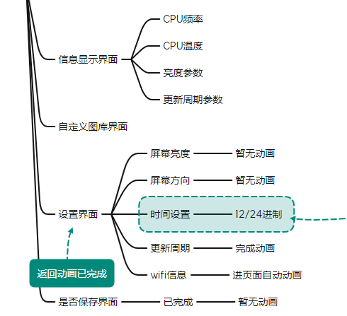
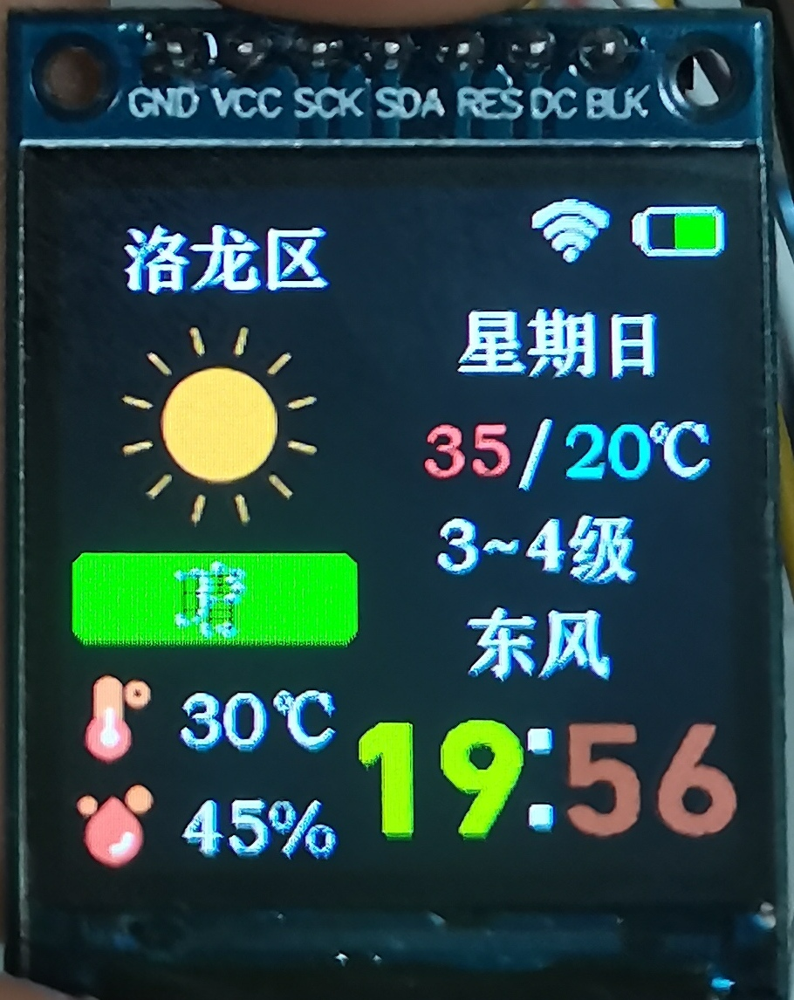
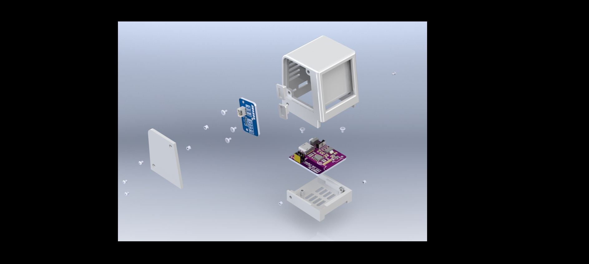
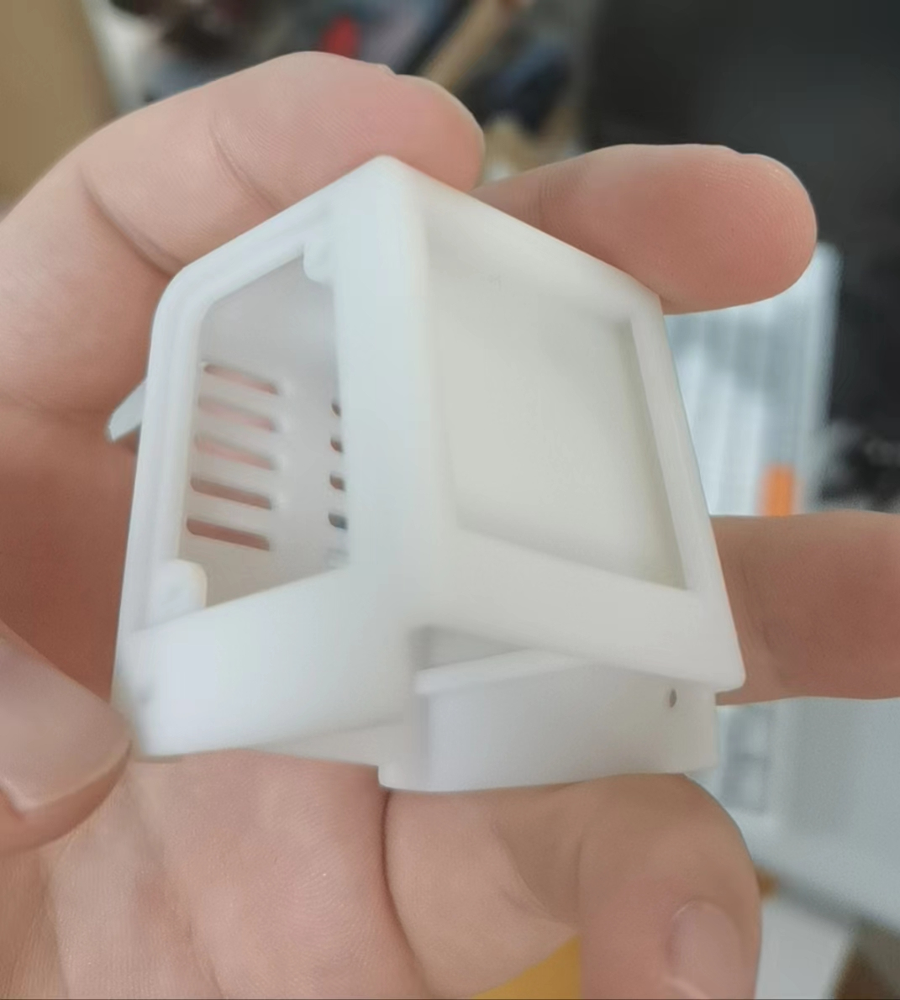
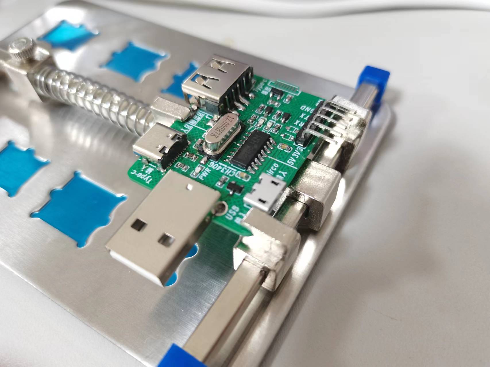
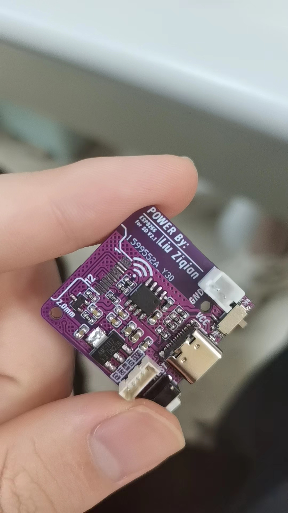

# 说明文档

**本项目目前已完成，后悔会持续维护**

## 一、项目说明

本项目是基于 ESP8266 的桌面天气时钟。该项目为开源项目，但是由于我本人觉得还有一些不足，于是给予修改，得到现在的这个版本。

### 1.1 硬件设计方面

硬件设计主要分为两个模块：**主控模块** 以及 **下载调试模块**。这样做是为了减小主控pcb的体积，将下载电路与控制电路分离，经过测试，方案可行。

- **主控模块：**主要采用ESP8266进行控制，集成 **锂电池充放电电路**、**电池电压检测电路**、**tft驱动电路**等
- **下载调试模块**：采用传统的CH340G进行串口通信，配置3输入（USB-A、Mirco-Usb、Type-C），3输出（5PIN 排针、type-c、USB）

### 1.2 软件设计方面

软件设计是基于 Arduino 库进行开发的，其主要有以下功能：

- 双功能按键
- 两种表盘设计
- 系统信息界面设计
- 设置界面设计
- MQTT数据订阅、发布

### 1.3 3D建模方面

在3D外壳的建模上没有过多的创新，仅仅是重新绘制了外壳模型，增加了按键的建模，增加了散热孔，美化外观。

### 1.4 上位机方面

不再使用Qt进行开发，而是采用 **微信小程序** 进行上位机的制作。将其接入MQTT，同时还接入了 **阿里云的移动研发平台（EMAS）**，使用其中的数据库以及云函数，做到远程控制的目的。

## 二、文件结构

- **doc**  为文档文件，包含各类文档说明
- **img** 为图片文件，用于 markdown 文件
- **inc** 为相关文件
- **src** 为代码文件

## 三、开发平台

- 本项目是基于 **VS code** 的 ESP8266编程

## 四、开发进度

- 在 **doc/esp8266天气时钟_思维导图.xmind** 中包含开发进度说明

  

- 目前处于 **信息显示界面** 的开发

- 以下是多功能表盘的示意图

  

- 3D外壳相关展示：

  

- 3D外壳实物部分展示

  

- PCB展示

  

  

- **截止于 2023年7月30日 所有工作均开发完成**

## 五、开发人员

- 本项目由 **Liu JIahao** 独立开发

## 六、版权说明

- 界面中的图标均来自[iconfont-阿里巴巴矢量图标库](https://www.iconfont.cn/)

## 七、项目地址

- **Gitee:** [刘佳豪/Esp8266_DeskBox (gitee.com)](https://gitee.com/liu-jiahaohappy/Esp8266_DeskBox)
- **Github:** [Jiahao-Liu29/Esp8266_DeskBox (github.com)](https://github.com/Jiahao-Liu29/Esp8266_DeskBox)

